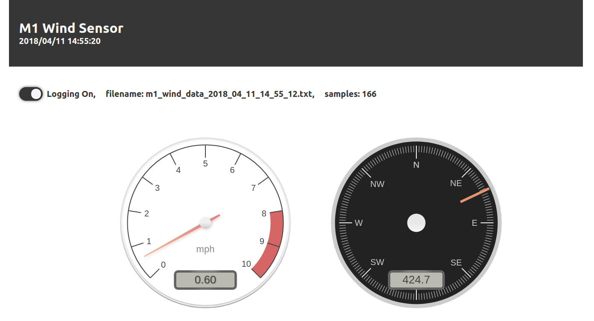

## M1 Wind Sensor 

Software and firmare for reading data from the MET One Intruments wind speed (Model 010C) and direction (Model 020C) sensors.

### Web App

### client 
* cd to software/javascript/m1_wind_sensor_client
* install requirements w/ npm install
* build dist w/  npm run-script build

### server 
* cd to software/javascript/m1_wind_sensor_server
* install requirements w/ npm install
* run w/ npm start

### Python App and Library
