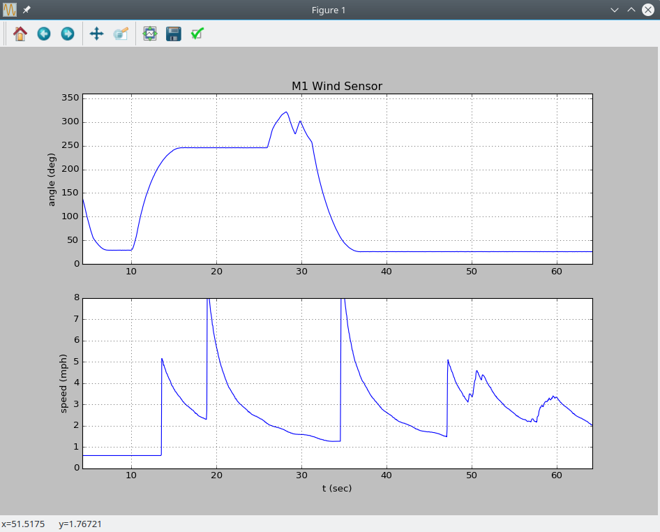

## M1 Wind Sensor 

Software and firmare for reading data from the MET One Intruments wind speed (Model 010C) and direction (Model 020C) sensors.

### Web App


### Client 
* Location:  software/javascript/m1_wind_sensor_client
* Install requirements w/ npm install
* Buid dist w/  npm run-script build

### Server 
* Location: software/javascript/m1_wind_sensor_server
* Install requirements w/ npm install
* Run w/ npm start

### Python logger app and library


* Location software/python/m1_wind_sensor
* Requirements: pyserial >= 3.01, matplotlib >= 1.5.1
* Install w/ setup.py install 

#### Logger app command line options

```text
usage: m1_logger [-h] [-p PORT] [-w WINDOW]

optional arguments:
  -h, --help            show this help message and exit
  -p PORT, --port PORT  met one sensor serial port
  -w WINDOW, --window WINDOW
                        length of display window (sec)
                        
```


#### Library: M1Logger Example
```python
from m1_wind_sensor import M1Logger

logger = M1Logger(port='/dev/ttyACM0', filename='my_data.txt', window_size=120.0)
logger.run()

```


#### Library: M1WindSensor Example

```python
import time
import sys
import matplotlib.pyplot as plt
from m1_wind_sensor import M1WindSensor

duration = 15.0
wind_sensor = M1WindSensor()
wind_sensor.start()

t0 = time.time()
time_list, angle_list, speed_list = [], [], []

while True:

    data = wind_sensor.get_data()
    if data is not None:
        time_list.append(data['time']*1.0e-3)
        angle_list.append(data['angle'])
        speed_list.append(data['speed'])
        print(data)

    if time.time() - t0 > duration:
        wind_sensor.stop()
        break;

plt.figure(1)
ax0 = plt.subplot(2,1,1)
plt.plot(time_list, angle_list,'.')
plt.ylabel('angle (deg)')
plt.grid('on')
plt.title('Met One Wind Sensor')

plt.subplot(2,1,2,sharex=ax0)
plt.plot(time_list, speed_list,'.')
plt.ylabel('speed (m/s)')
plt.grid('on')

plt.show()
```

### Firmware

* firmware_v1 = original version firmware
* firmware_v2 = most recent version of firmware using template class + static methods for callbacks
* Designed for teensy 3.2 development board
* Requires [Streaming](http://arduiniana.org/libraries/streaming/)  and [ArduinoJson](https://arduinojson.org/)
* Wind Direction sensor is connected to analog input A0 (0-2.5V range from sensor)
* Wind Speed sensor is connected to digital input 2 (0-3.3V range from sensor)
* Build and program with the [Arduino IDE](https://www.arduino.cc/en/Main/Software) with the [TeensyDuino](https://www.pjrc.com/teensy/teensyduino.html) addon.
